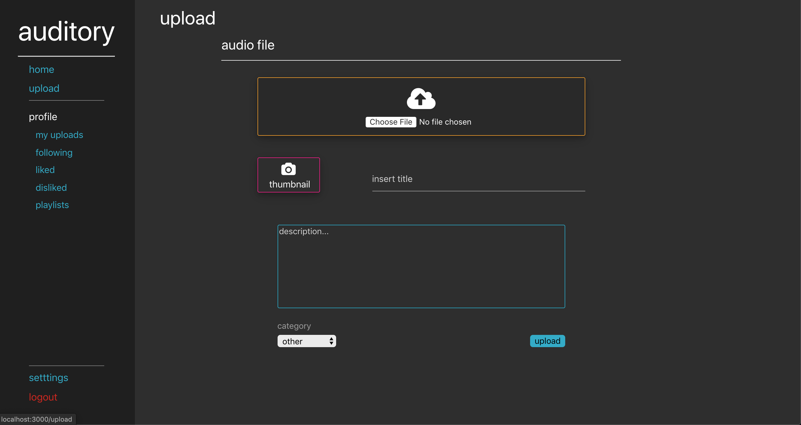
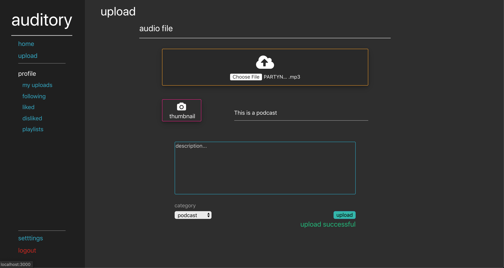
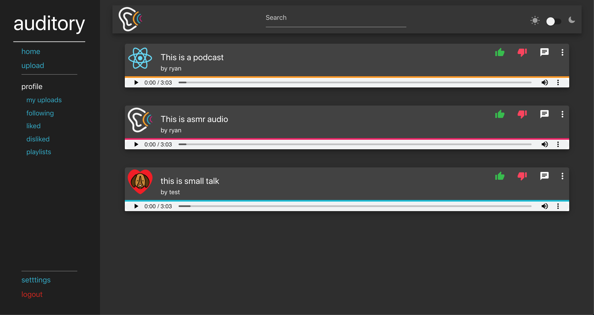
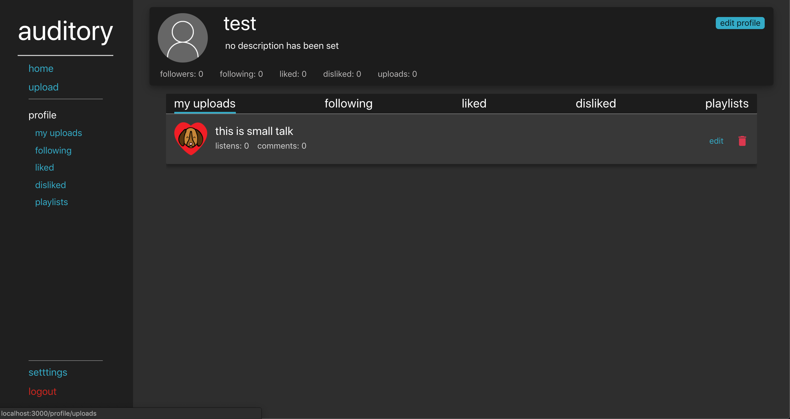
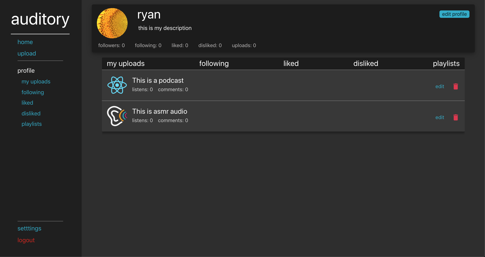
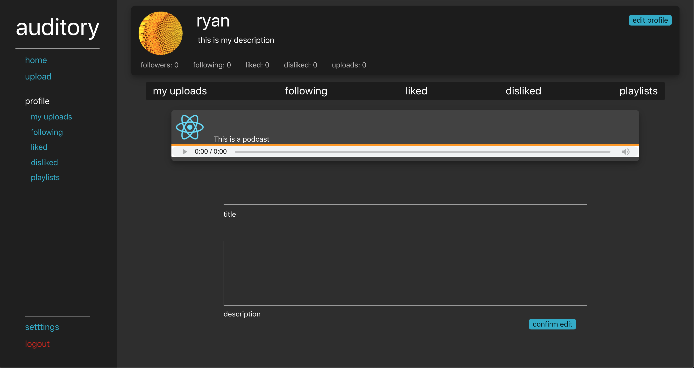

# auditory
auditory is an app where a user can upload any audio files and share then with the world.
Think of it like a youtube, but for audio files. Potential categories can be: Podcasts, music, ASMR, small talks, and more (im sure there are mor categories that users can come up with).

This is a single page application created using: 
* MongoDB
* Express
* React
* Node.js

This is a very ambitious project that will take who knows how long to be finished.

Features that will be implemented: 
* like / dislike uploads
* comment on uploads
* follow other users
* create playlists
* expand upon the default html "audio" tag
* autoplay
* track number of listens
* more user friendly
* smoother transitions
* and many many more

[TrelloBoard]() / [Deployed app on heroku](https://auditory-app.herokuapp.com/)

Screenshots:

